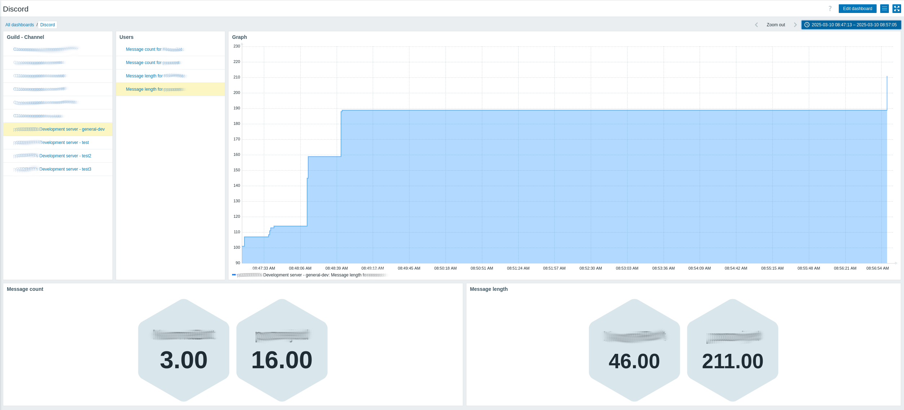

# A dicord bot to monitor your guild/server using Zabbix!

Install the requirements, build the config.json with your tokens and the IP of the zabbix server (DNS somehow gives errors)
To get a token for discord, visit https://discord.com/developers and signup for a new application
In the menu, go to Bot to reset your token and get it.
Also make sure to enable the intents:
 - PRESENCE INTENT
 - SERVER MEMBERS INTENT
 - MESSAGE CONTENT INTENT

 Then go to Installation and copy the install link, paste in a new browserwindow and let it join the server you want.
 Start main.py (in a docker or wherever you can run it 24/7 with access to your zabbix server and internet)

 It will make a Hostgroup called "Discord channels" and add a host per channel. (Guild - Channel)
 Every user will become an item the first time they send a messgage and it will be raised on every message.
 A second item wil sum the length of all messages together, so typing less but longer messages will be monitored!
 The bot will keep the ids and counts in memory to save on api calls to zabbix, after a restart it will get the data from zabbix again on first message.

## Creating a dashboard

Add a new dashboard, add a host navigator for Host group "Discord channels", name it "Guild - Channel"
Add a item navigator for the same hostgroup, for the hosts select the Host navigator (Guild - Channel) we just made. Name it "Users".

Add a graph, remove the default dataset, add a new dataset as Item list and point it to the item navigator (Users).
I used the line color #0080FF, line widht 2, missing data "connected" and selected Staircase, but feel free to use your own settings!

I also added 2 honeycombs.
The first:
 - Name: Message count
 - Hostgroup: Discord Channels
 - Hosts: widget -> Guild - Channel
 - Item Patern: Message count *
 - Advanced configuration > Primary label > Text: {{ITEM.NAME}.regrepl("Message count for", "")}
 - Advanced configuration > Secondary label > Decimal places: 0

The second:
 - Name: Message length
 - Hostgroup: Discord Channels
 - Hosts: widget -> Guild - Channel
 - Item Patern: Message length *
 - Advanced configuration > Primary label > Text: {{ITEM.NAME}.regrepl("Message length for", "")}
 - Advanced configuration > Secondary label > Decimal places: 0

